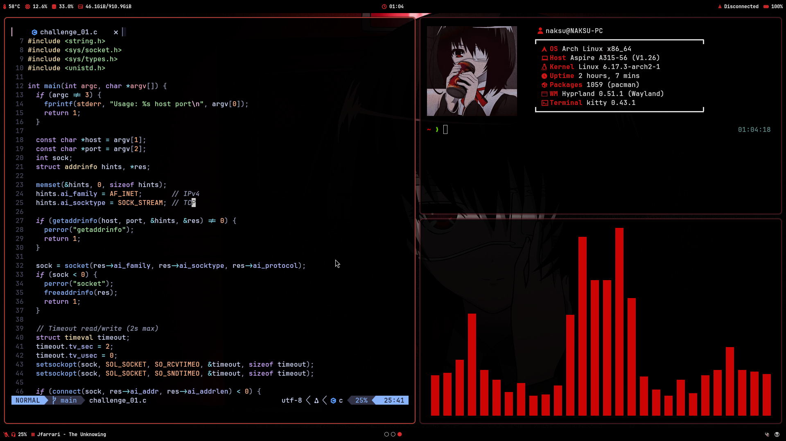

# dotfiles
Welcome to my **dotfiles**! This repo contains my configuration files, "optimized" for a [Hyprland](https://hypr.land/) setup. It also includes configuration for development tools, terminal environment, and overall appearance...

## Overview

## Stuff I use
- **Shell**: zsh with Oh-My-Zsh plugins and custom aliases.
- **WM**: Hyprland with waybar, rofi and SwayNotificationCenter.
- **Terminal**: kitty
- **Editor**: Neovim with the catppucin mocha theme.

## Checklist
- [ ] Auto-spawn a tmux session on SSH login
- [ ] Configure tmux status bar
- [ ] Clean up the .zshrc file 
