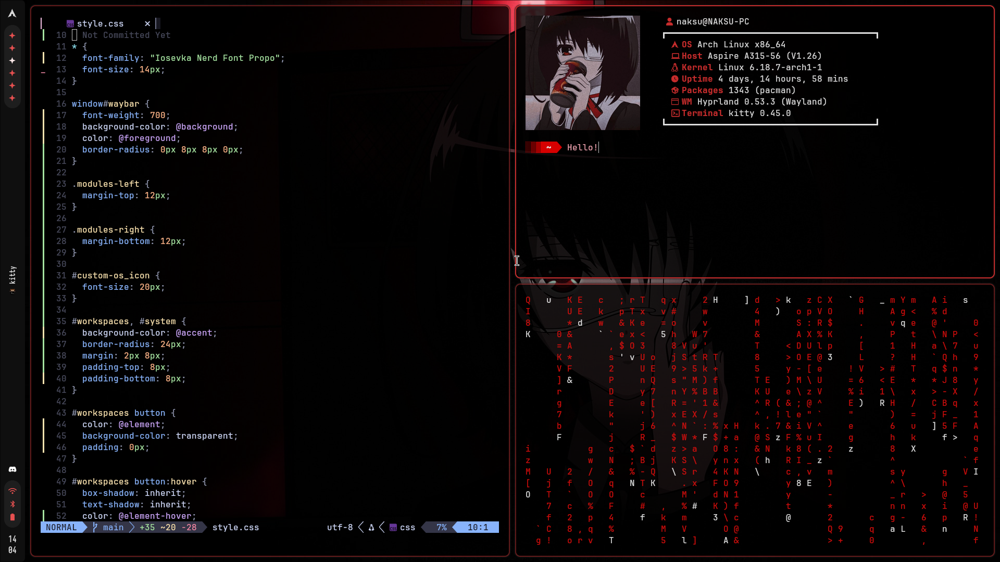

# dotfiles
Welcome to my **dotfiles**! This repo contains my configuration files, "optimized" for a [Hyprland](https://hypr.land/) setup. It also includes configuration for development tools, terminal environment, and overall appearance...

It's mainly used on a laptop.

## Overview

## Stuff I use
- **Shell**: zsh with Oh-My-Zsh plugins and custom aliases.
- **WM**: Hyprland with waybar, rofi and SwayNotificationCenter.
- **Terminal**: kitty
- **Editor**: Neovim with the catppucin mocha theme.

## Plugins used with zsh
- [fzf-tab](https://github.com/Aloxaf/fzf-tab)
- [zsh-autosuggestions](https://github.com/zsh-users/zsh-autosuggestions)
- [zsh-syntax-highlighting](https://github.com/zsh-users/zsh-syntax-highlighting)
- [zsh-fzf-history-search](https://github.com/joshskidmore/zsh-fzf-history-search)
